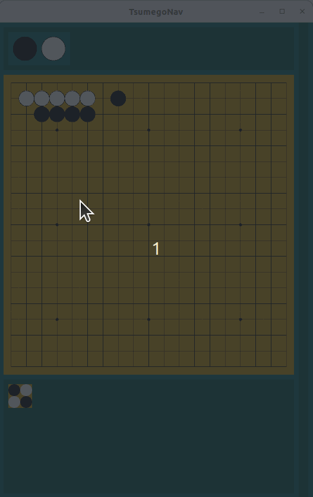

# TsumegoNav

The intention of this App is to give Go players a tool for solving Tsumego, in a method where the answers are not provided.

Initial development has been focused on basic controls of the Board, the Navigation Tree, and the interactions between the two.

Latest example clip (posted 2023-06-27):

